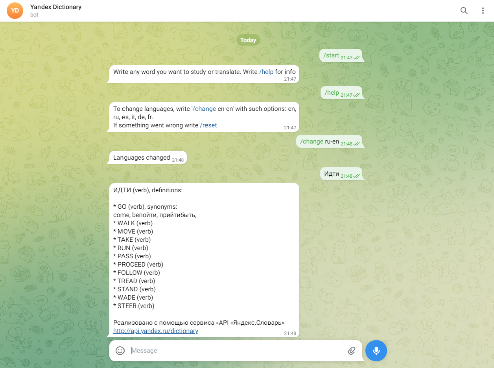

# Dictionary Telegram Bot

[Telegram бот](t.me/YandexDictBot), который выполняет роль переводчика и словаря синонимов.



## Технологии
+ API [Telegram Bot](https://github.com/go-telegram-bot-api/telegram-bot-api)
+ API [Яндекс.Словарь](http://api.yandex.ru/dictionary)
+ net/http

## Установка
Необходимо заменить ключи от api в файле **.env** на свои
```
BOT_KEY=TELEGRAM_KEY
DICT_KEY=YANDEX_KEY
```
И прописать в консоли
```
go run main.go
```